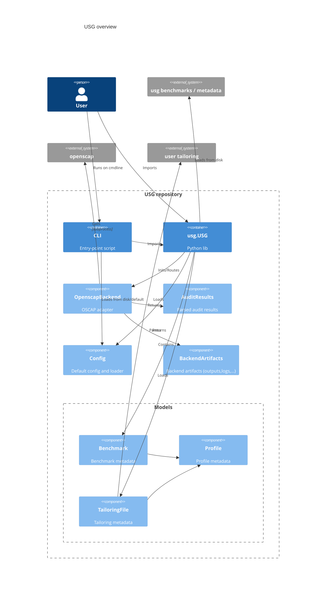

## Overview

This document gives a brief technical overview of the contents of the ubuntu-security-guide repository,
including the USG python module, build tooling, debian maintainer scripts and other important files.

### USG

Since https://github.com/canonical/ubuntu-security-guide/pull/76 , the USG tool is written in Python
while retaining CLI backwards compatibility with the legacy Bash version.

The main functionality of usg is in `src/usg/`, including the USG python module, the CLI wrapper script and the legacy fallback script:

```sh
src/
├── cli
│   └── usg                  # CLI wrapper script (installed to /sbin; calls usg.cli)
├── legacy 
│   └── usg                  # legacy Bash usg (fallback if python3 is not available)
└── usg
    ├── backends.py          # adapter classes for auditing/remediation
    ├── cli.py               # CLI entry point, CLI parsing, list/info implementations
    ├── config.py            # default config and loader functions
    ├── models.py            # data classes for benchmarks, profiles, tailoring files
    ├── results.py           # data classes for audit results
    ├── usg.py               # core module (used by CLI)
    ├── utils.py             # utility functions like gunzipping, permission checks, etc
    ├── constants.py
    ├── exceptions.py
    └── version.py
```
The implementation details are described in some more detail later.

### Project configuration

The project version, configuration and metadata is in `pyproject.toml`. On older platforms (Ubuntu <= 22.04), `setup.cfg` is used due to lack of support for pyproject.toml in setuptools<61.0.

### Data directories

Data files packaged and installed alongside USG (benchmarks, manpages, configs) are in:

```
benchmarks/                  # placeholder for benchmark data (see Build tooling)
doc/                         # placeholder for manpages (see Build tooling)
├── man7
├── man8
templates/                   # templates for building tailoring_files/docs
├── doc
└── tailoring
conf/                        # usg configuration files
├── logrotate.d 
└── usg.conf
```

### Tools

The `tools/` folder contains several utility scripts for building benchmark data used by USG, and deploying and testing USG in container environments.

#### Build tooling

The build script `build.py` is used call the various tools to:
- compile [ComplianceAsCode content](https://github.com/ComplianceAsCode/content) based on tags defined in `tools/release_metadata/`
- extract SCAP datastreams
- generate tailoring files and manpages from templates
- generate the necessary metadata files for USG
- populate `benchmarks/` and `docs/` folders

##### Example build:

```
# install dependencies for building ComplianceAsCode
# install OpenSCAP
# install build dependencies
# (e.g. on Ubuntu 24.04)
sudo apt install openscap-scanner python3-yaml python3-lxml

# Obtain a copy of the CaC-content repo
git clone https://github.com/ComplianceAsCode/content /tmp/CaC-content

# Define benchmark release metadata in "tools/release_metadata" (see below)
vim tools/release_metadata/cis.yaml

# Run tool script
tools/build.py -c /tmp/CaC-content
```

##### Benchmark release metadata

The benchmark data is built based on the metadata defined in `tools/release_metadata/`.
This folder contains `*.yaml` files describing all benchmarks which should be considered for the build,
their git tags/commits in the ComplianceAsCode project, and their parent releases.

Annotated example:
```yaml
general:
  benchmark_type: CIS     # type, either CIS or STIG (each type has its own file)
  product: ubuntu2404
  product_long: Ubuntu 24.04 LTS (Noble Numbat)

benchmark_releases:
  - cac_tag: v0.1.78           # Git tag in ComplianceAsContent-content
    parent_tag: v0.1.77        # Tag of parent CaC release
    breaking_release: True     # Set to True if the release introduces backwards-incompatible changes to tailoring file
    tailoring_version: 2       # Version of tailoring file (must be incremented with every breaking release)
    cac_commit: f7d79485...    # Git commit corresponding to above tag
    usg_version: 24.04.5
    benchmark_data:            # Benchmark metadata (version, profiles, description, etc)
      version: v1.0.0
      profiles:
          cis_level1_server: {}
          cis_level2_server: {}
          cis_level1_workstation: {}
          cis_level2_workstation: {}
      description: |
          ComplianceAsCode implementation of CIS Ubuntu 24.04 LTS v1.0.0 benchmark.
      release_notes_url: https://github.com/canonical/ubuntu-security-guide/pull/72
      reference_url: https://www.cisecurity.org/benchmark/ubuntu_linux/

  - cac_tag: v0.1.77
    parent_tag:                # no parent tag, initial release
    breaking_release: False
    tailoring_version: 1
    ...
```

Based on this information, the build tools resolve the benchmark release graph, and build the active releases:
- the latest release
- all releases preceding a breaking release (deprecated versions)

Releases which are superseded by a compatible release (non-breaking; not introducing backwards incompatible changes to the tailoring file)
are not included in the build.


#### Testing tools

For easy live testing, you can run:
```sh
sudo apt install podman
./tools/run_container.sh noble
./tools/run_container.sh jammy
```
The script will setup a Ubuntu 24.04 (noble) or Ubuntu 22.04 (jammy) container with USG and
sample benchmarks from test data.

Example usg commands:
```sh
usg list --all
usg info cis_level1_server
usg audit cis_level1_server --debug
```

To run the unit tests and e2e tests on all supported platforms using containers, run:
```sh
sudo apt install podman
./tools/run_tests.sh
```

### Debian packaging

The debian packaging uses the pybuild backend, based on the metadata in `pyproject.toml` (doesn't work
in jammy due to setuptools<61.0 -> uses setup.cfg instead). 

Install locations:
- The python package `usg` is installed as a *private package* to `/usr/share/usg`.
- The USG CLI wrappper is installed to `/sbin/usg`
- Benchmark data is installed to `/usr/share/usg-benchmarks` **

**The legacy `usg-benchmarks-N` binary package was replaced with `usg-benchmarks`, which now contains all the available benchmarks in gzipped format, together with the metadata file `benchmarks.json`.

#### Autopkgtests

Autopkgtests scripts are stored in `debian/tests` and include a version check and E2E tests for the USG CLI.

#### Bash completions

Bash completions for usg CLI tool are in `debian/usg.bash-completion`.


## Development

To setup the dev environment: (needs python >= 3.12, tested on Noble)
```
python3 -m venv .venv
source .venv/bin/activate
pip install -r dev-requirements.txt

# run tests with coverage
coverage erase && coverage run --source . -m pytest && coverage html && coverage report -m

# run linting
ruff check .
```


## USG implementation details

#### High-level

The code consists of a python lib that the user can import:
```python
# require
import usg
usg = usg.USG()
profile = usg.get_profile('cis_level1_server')
results, output_files = usg.audit(profile)
```
and a CLI which implements the lib:
```sh
usg audit -p cis_level1_server
```


#### Main components

##### USG

The central processing component in the code is the **usg.USG()** class which owns and manages:
- Benchmark metadata - loads _benchmarks.json_ and stores it as _Benchmark_ and _Profile_ objects
- Benchmark data - extracts necessary data files from the benchmark archives _ssg-ubuntu2404-ds.xml.gz_, e.g. datastream
- Routing commands - routes commands (_audit/fix/generate_fix_) to a backend object, e.g. _OpenscapBackend_
- Tailoring files - loads tailoring files as _TailoringFile_ and generates tailoring files via archive extraction

Input for the class is a configuration object _ConfigParser_. If None, the configuration defaults to settings defined in the `config` module.

##### Profile, Benchmarks, Tailoring files

The interface is built around the main data component **Profile** (reason is primarily legacy support).
The Profile class contains metadata information about a profile and also references the
corresponding _Benchmark_ and _TailoringFile_ objects (if any).

Note on the tailoring files - although they are in principle backend-specific, their loading and generation are placed in the USG domain
because a) Their creation is not related to the backend (static files extracted from the benchmark archive file) b) The `--tailoring-file` is a primary CLI arg, conceptually on the same level as `--profile`, thus the functions `get_profile()` and `load_tailoring()`


##### Backend and Results

All functions implementing the commands (audit/fix/generate_fix/generate_tailoring) take _Profile_ as the primary argument,
initialize the backend adapter (**OpenscapBackend**) in a secure temporary dir, and route the necessary information to the adapter.
This adapter class takes care of setting up command line args, calling the `oscap` binary, and processing and returning the
auditing output in form of **AuditResults**. All backend output files are created in the secure temporary dir using hardcoded names,
and are returned to the caller (USG) via the **BackendArtifacts** object.




#### CLI

The CLI is implemented in `usg.cli` and does the basic tasks of argument parsing and config loading, but also implements some functionality which does not
exist in the library (printing information about profiles to screen).
What the CLI does:
- Loads configuration via `config.load_config()` from `/etc/usg.conf`, overriding defaults
- Parses CMDline arguments (ensuring backwards compatibility with legacy USG)
- Overrides config defaults for report/results/product/version
- Initializes logging to log file defined in config
- Initializes `usg.USG()`
- Routes subcommands `audit/fix/generate-fix/generate-tailoring` to USG
- Implements subcommand `list` (lists available profiles)
- Implements subcommand `info` (queries USG for a selected profile or tailoring file object and prints info)

